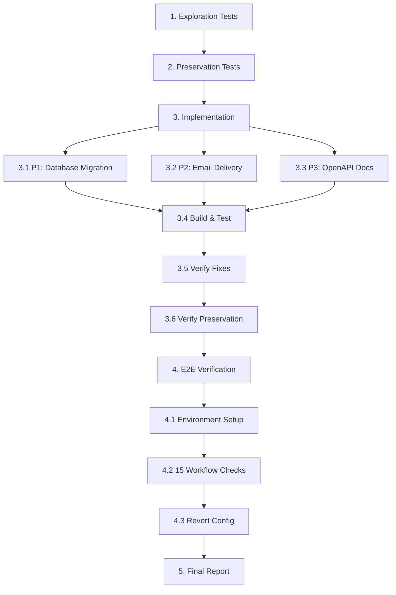

# Implementation Plan

## Overview

This task list implements fixes for three post-merge production blockers using the bug condition methodology:
- **P1**: Database schema drift - verify and apply Phase 7 migration to development-e2e worktree database
- **P2**: Password-reset token discarded - integrate email delivery with existing IEmailSender infrastructure  
- **P3**: OpenAPI documentation gaps - add bearer security scheme and required Idempotency-Key headers

**Execution Order**: Exploration tests (fail on unfixed code) → Preservation tests (pass on unfixed code) → Implementation → Verification → Report

## Tasks

### Phase 1: Exploration Tests (BEFORE Fix)

- [x] 1. Write bug condition exploration tests for all three blockers
  - **Property 1: Bug Condition** - Post-Merge Production Blockers
  - **CRITICAL**: These tests MUST FAIL on unfixed code - failure confirms the bugs exist
  - **DO NOT attempt to fix the tests or the code when they fail**
  - **NOTE**: These tests encode the expected behavior - they will validate the fixes when they pass after implementation
  - **GOAL**: Surface counterexamples demonstrating all three bugs exist
  
  **P1 - Database Schema Drift:**
  - Verify development-e2e worktree database lacks Phase 7 migration (check __EFMigrationsHistory)
  - Test campaign approval via POST /admin/campaigns/{id}/approve
  - **EXPECTED**: HTTP 500 with SQL error for missing DeliveryJobRuns/DeliveryRecoveryDispatches tables
  - Test query to DeliveryJobRuns, DeliveryRecoveryDispatches tables
  - **EXPECTED**: SQL exception (table does not exist)
  - Test access to DoctorMessageQueues.RowVersion, DoctorAdDeliveries.ExpiredAtUtc columns
  - **EXPECTED**: SQL exception (column does not exist)
  - Document counterexamples: specific SQL errors, stack traces, missing table/column names
  
  **P2 - Password-Reset Token Discarded:**
  - Test password reset request via POST /auth/forgot-password with valid user email
  - **EXPECTED**: HTTP 200 response but IEmailSender.SendPasswordResetEmailAsync NOT called
  - Verify database contains hashed reset token
  - Verify no email sent (check email inbox or mock IEmailSender logs)
  - Document counterexamples: token generated and hashed but never emailed
  
  **P3 - OpenAPI Documentation Gaps:**
  - Navigate to /swagger and fetch OpenAPI JSON (GET /swagger/v1/swagger.json)
  - **EXPECTED**: Missing components.securitySchemes.Bearer in OpenAPI document
  - Inspect POST /campaigns operation definition
  - **EXPECTED**: Idempotency-Key parameter missing or not marked as required
  - Inspect admin pricing endpoint parameter descriptions
  - **EXPECTED**: DoctorProfile ID parameter lacks clarifying description
  - Document counterexamples: specific missing sections in OpenAPI JSON
  
  - Mark task complete when all three tests are written, run, and failures documented
  - _Requirements: 1.1, 1.2, 1.3, 1.4, 1.5, 1.6, 2.1, 2.2, 2.3, 3.1, 3.2, 3.3_

## Phase 2: Preservation Tests (BEFORE Fix)

- [x] 2. Write preservation property tests for all three blockers (BEFORE implementing fixes)
  - **Property 2: Preservation** - Existing Functionality Preservation
  - **IMPORTANT**: Follow observation-first methodology
  
  **P1 - Database Operations Preservation:**
  - Observe: Query Users, Campaigns, DoctorProfiles, Companies, Wallets on UNFIXED code
  - Record results and __EFMigrationsHistory state
  - Write property-based test: Pre-Phase-7 database queries return expected results
  - Write property-based test: __EFMigrationsHistory integrity maintained
  - Verify tests pass on UNFIXED code
  - **EXPECTED OUTCOME**: Tests PASS (confirms baseline behavior to preserve)
  
  **P2 - Auth and Email Flows Preservation:**
  - Observe: Login flow (doctor, company, admin) on UNFIXED code
  - Observe: OTP verification emails, account approval emails on UNFIXED code
  - Record authentication token issuance, refresh token flow, existing email deliveries
  - Write property-based test: Login flow produces same JWT tokens
  - Write property-based test: Existing email flows (OTP, approval) continue working
  - Write property-based test: Token validation, expiry checking unchanged
  - Verify tests pass on UNFIXED code
  - **EXPECTED OUTCOME**: Tests PASS (confirms baseline behavior to preserve)
  
  **P3 - Runtime API Behavior Preservation:**
  - Observe: Swagger UI rendering all endpoints on UNFIXED code
  - Observe: Runtime bearer token validation (invalid token rejected)
  - Observe: Runtime idempotency key validation (missing key rejected)
  - Record endpoint visibility, security validation behavior
  - Write property-based test: All endpoints visible in Swagger UI
  - Write property-based test: Runtime bearer token validation unchanged
  - Write property-based test: Runtime idempotency key validation unchanged
  - Verify tests pass on UNFIXED code
  - **EXPECTED OUTCOME**: Tests PASS (confirms baseline behavior to preserve)
  
  - Mark task complete when all preservation tests are written, run, and passing on unfixed code
  - _Requirements: 3.1, 3.2, 3.3, 3.4, 3.5, 3.6, 3.7, 3.8, 3.9, 3.10, 3.11_

## Phase 3: Implementation

- [x] 3. Fix post-merge production blockers

  - [x] 3.1 P1: Verify and apply Phase 7 migration to development-e2e worktree database
    - Locate development-e2e worktree (check `.git/worktrees/` or run `git worktree list`)
    - Identify E2E database connection string from appsettings in development-e2e worktree
    - Query `SELECT MigrationId FROM __EFMigrationsHistory` to verify if `20260702174103_AddPhase7DeliveryExpiryJobs` is present
    - If missing, navigate to development-e2e worktree directory
    - Run `dotnet ef database update --project MediBridge.Repository --startup-project MediBridge.APIs` to apply existing migration
    - **DO NOT create duplicate migration** - use existing `20260702174103_AddPhase7DeliveryExpiryJobs.cs`
    - Verify migration applied: Query `SELECT COUNT(*) FROM DeliveryJobRuns` (should succeed)
    - Verify migration applied: Query `SELECT COUNT(*) FROM DeliveryRecoveryDispatches` (should succeed)
    - Verify columns exist: `DoctorMessageQueues.RowVersion`, `DoctorAdDeliveries.ExpiredAtUtc`
    - _Bug_Condition: isBugCondition_P1(dbContext) where NOT EXISTS(DeliveryJobRuns) OR NOT EXISTS(DeliveryRecoveryDispatches) OR missing RowVersion/ExpiredAtUtc columns_
    - _Expected_Behavior: Campaign approval returns HTTP 200, delivery job queries succeed_
    - _Preservation: Pre-Phase-7 queries unchanged, __EFMigrationsHistory integrity maintained_
    - _Requirements: 2.1, 2.2, 2.3, 2.4, 2.5, 2.6, 2.7, 3.1, 3.2, 3.3_

  - [x] 3.2 P2: Implement password-reset email delivery in AuthService.cs
    - Locate password reset token generation method in `MediBridge.Services/Services/AuthService.cs` (likely `RequestPasswordResetAsync`)
    - Identify where plaintext token is generated and hashed
    - After token generation, preserve plaintext in local variable before hashing:
      ```csharp
      var plaintextToken = GenerateResetToken();
      var hashedToken = HashToken(plaintextToken);
      await _repository.SaveResetToken(userId, hashedToken, expiryTime);
      ```
    - After persisting hashed token, call IEmailSender to send plaintext token:
      ```csharp
      var resetLink = $"{_appSettings.FrontendUrl}/reset-password?token={plaintextToken}";
      await _emailSender.SendPasswordResetEmailAsync(userEmail, resetLink);
      ```
    - Use existing IEmailSender interface (already used for OTP emails, approval notifications)
    - Email template: Subject "MediBridge Password Reset Request", body includes reset link with token, expiry notification
    - **Security**: Do NOT log plaintext token, do NOT return in HTTP response, do NOT persist plaintext in database
    - Clear plaintextToken variable immediately after email sending
    - _Bug_Condition: isBugCondition_P2(resetRequest) where TokenGenerated AND NOT TokenEmailed_
    - _Expected_Behavior: Email sent with plaintext token, token hashed in database, no token leaks_
    - _Preservation: Token hashing/expiry/validation unchanged, login flow unchanged, existing email infrastructure unchanged_
    - _Requirements: 2.8, 2.9, 2.10, 2.11, 3.4, 3.5, 3.6, 3.7_

  - [x] 3.3 P3: Add OpenAPI bearer security and Idempotency-Key documentation
    - **File**: `MediBridge.APIs/Program.cs`
    - Add bearer security scheme in SwaggerGen configuration:
      ```csharp
      builder.Services.AddSwaggerGen(options =>
      {
          // Add bearer authentication scheme
          options.AddSecurityDefinition("Bearer", new OpenApiSecurityScheme
          {
              Name = "Authorization",
              Type = SecuritySchemeType.Http,
              Scheme = "bearer",
              BearerFormat = "JWT",
              In = ParameterLocation.Header,
              Description = "JWT Authorization header using the Bearer scheme."
          });
          
          options.AddSecurityRequirement(new OpenApiSecurityRequirement
          {
              {
                  new OpenApiSecurityScheme
                  {
                      Reference = new OpenApiReference
                      {
                          Type = ReferenceType.SecurityScheme,
                          Id = "Bearer"
                      }
                  },
                  Array.Empty<string>()
              }
          });
      });
      ```
    - **File**: Create `MediBridge.APIs/Filters/IdempotencyKeyOperationFilter.cs`
    - Implement IOperationFilter to add Idempotency-Key header to mutation endpoints:
      ```csharp
      public class IdempotencyKeyOperationFilter : IOperationFilter
      {
          public void Apply(OpenApiOperation operation, OperationFilterContext context)
          {
              var isMutation = context.ApiDescription.HttpMethod?.ToUpper() 
                  is "POST" or "PUT" or "PATCH" or "DELETE";
              
              if (isMutation)
              {
                  operation.Parameters ??= new List<OpenApiParameter>();
                  operation.Parameters.Add(new OpenApiParameter
                  {
                      Name = "Idempotency-Key",
                      In = ParameterLocation.Header,
                      Required = true,
                      Schema = new OpenApiSchema { Type = "string" },
                      Description = "Unique identifier for idempotent request handling"
                  });
              }
          }
      }
      ```
    - Register operation filter in Program.cs: `options.OperationFilter<IdempotencyKeyOperationFilter>();`
    - Add XML documentation to admin pricing endpoint controller action clarifying DoctorProfile ID parameter
    - Ensure `options.IncludeXmlComments()` configured in SwaggerGen
    - _Bug_Condition: isBugCondition_P3(openApiDoc) where NOT HasBearerSecurityScheme OR NOT HasRequiredIdempotencyKeyHeader_
    - _Expected_Behavior: Bearer scheme documented, Idempotency-Key marked required, DoctorProfile ID clarified_
    - _Preservation: Swagger UI rendering unchanged, runtime bearer/idempotency validation unchanged_
    - _Requirements: 2.12, 2.13, 2.14, 3.8, 3.9, 3.10, 3.11_

  - [x] 3.4 Build and run automated tests
    - Run `dotnet build` from workspace root to verify compilation
    - Verify build succeeds with no errors
    - Run `dotnet test` to execute unit and integration test suite
    - Verify all tests pass after fixes applied
    - Document build output and test results

  - [x] 3.5 Verify bug condition exploration tests now pass
    - **Property 1: Expected Behavior** - Post-Merge Production Blockers Fixed
    - **IMPORTANT**: Re-run the SAME tests from task 1 - do NOT write new tests
    - The tests from task 1 encode the expected behavior
    - When these tests pass, it confirms the expected behavior is satisfied
    
    **P1 - Database Schema Drift Fixed:**
    - Re-run campaign approval test via POST /admin/campaigns/{id}/approve
    - **EXPECTED**: HTTP 200 response (no more HTTP 500)
    - Query DeliveryJobRuns table - **EXPECTED**: Query succeeds, rows may be created
    - Query DeliveryRecoveryDispatches table - **EXPECTED**: Query succeeds
    - Access DoctorMessageQueues.RowVersion, DoctorAdDeliveries.ExpiredAtUtc - **EXPECTED**: Column access succeeds
    
    **P2 - Password-Reset Token Delivered:**
    - Re-run password reset request test via POST /auth/forgot-password
    - **EXPECTED**: HTTP 200 AND IEmailSender.SendPasswordResetEmailAsync called with plaintext token
    - Verify email received with reset link
    - Use received token to complete reset via POST /auth/reset-password
    - **EXPECTED**: Password reset succeeds, token single-use enforced
    - Verify database contains hashed token (not plaintext)
    - Verify HTTP response does not contain plaintext token
    
    **P3 - OpenAPI Documentation Complete:**
    - Re-fetch OpenAPI JSON (GET /swagger/v1/swagger.json)
    - **EXPECTED**: components.securitySchemes.Bearer exists with type "http", scheme "bearer"
    - **EXPECTED**: security array includes Bearer scheme
    - Inspect POST /campaigns operation - **EXPECTED**: Idempotency-Key parameter present with required: true
    - Inspect admin pricing endpoint - **EXPECTED**: DoctorProfile ID parameter has clarifying description
    
    - _Requirements: 2.1, 2.2, 2.3, 2.4, 2.5, 2.6, 2.7, 2.8, 2.9, 2.10, 2.11, 2.12, 2.13, 2.14_

  - [x] 3.6 Verify preservation tests still pass
    - **Property 2: Preservation** - No Regressions
    - **IMPORTANT**: Re-run the SAME tests from task 2 - do NOT write new tests
    - Run all preservation property tests from task 2
    - **EXPECTED OUTCOME**: All tests PASS (confirms no regressions)
    
    **P1 - Database Operations Preserved:**
    - Verify pre-Phase-7 queries (Users, Campaigns, DoctorProfiles, etc.) return same results as before fix
    - Verify __EFMigrationsHistory includes both pre-Phase-7 and Phase 7 migrations
    
    **P2 - Auth and Email Flows Preserved:**
    - Verify login flow (doctor, company, admin) works identically
    - Verify OTP verification emails still delivered
    - Verify account approval notification emails still delivered
    - Verify token validation and expiry checking unchanged
    
    **P3 - Runtime API Behavior Preserved:**
    - Verify all endpoints still visible in Swagger UI
    - Verify invalid bearer token still rejected at runtime
    - Verify missing Idempotency-Key still rejected at runtime
    
    - _Requirements: 3.1, 3.2, 3.3, 3.4, 3.5, 3.6, 3.7, 3.8, 3.9, 3.10, 3.11_

## Phase 4: Real HTTP/E2E Verification

- [ ] 4. Execute comprehensive E2E workflow verification with real HTTP requests

  - [ ] 4.1 Environment setup for E2E verification
    - Ensure API running locally with real SQL Server database connection
    - Ensure real Cloudinary integration configured
    - **Temporarily enable** `DeliveryJobs__Enabled=true` in appsettings.Development.json for verification only
    - **DO NOT commit** this configuration change
    - Document API URL, database server/name (mask credentials)

  - [~] 4.2 Execute all 15 E2E workflow checks
    1. ✓ Swagger/OpenAPI reachable (GET /swagger) - **P3 fix verification: bearer scheme and Idempotency-Key visible**
    2. ✓ Admin login works (POST /auth/login with admin credentials)
    3. ✓ Doctor/Company registration and workflow works
    4. ✓ OTP/contact verification works (existing email infrastructure preserved)
    5. ✓ Admin account approval works (existing email infrastructure preserved)
    6. ✓ Wallet/top-up/idempotency works (idempotency key validation preserved)
    7. ✓ File upload/access/replacement/delete/review works with real Cloudinary (Cloudinary integration preserved)
    8. ✓ Campaign draft/update/submit works
    9. ✓ **Admin campaign approval succeeds without HTTP 500** ← **P1 fix verification**
    10. ✓ Queue rows created after campaign approval (DeliveryJobRuns, DoctorMessageQueues queries succeed)
    11. ✓ Delivery/recovery/expiry/injection jobs work (verify with DeliveryJobs__Enabled=true)
    12. ✓ Doctor inbox/messages reflect expected delivery state
    13. ✓ **Forgot/reset password works using delivered reset token** ← **P2 fix verification**
    14. ✓ **OpenAPI documents bearer security and required Idempotency-Key** ← **P3 fix verification**
    15. ✓ No regression in previously working workflows
    - Document results in verification table (pass/fail for each check)
    - Capture any errors or unexpected behavior
    - _Requirements: All requirements from bugfix.md_

  - [~] 4.3 Revert temporary configuration changes
    - Set `DeliveryJobs__Enabled=false` in appsettings.Development.json
    - Verify no secrets or test data committed
    - Run `git status` to confirm only intended changes staged

## Phase 5: Final Report and Checkpoint

- [~] 5. Generate final verification report and ensure all tests pass
  - Create comprehensive verification report including:
    - ✓ Real HTTP/E2E verification confirmation (all 15 checks)
    - ✓ API URL used (credentials masked)
    - ✓ Database server/name used (credentials masked)
    - ✓ Whether delivery jobs were enabled during verification (yes, temporarily)
    - ✓ Migration state before fix: development-e2e worktree database missing Phase 7 migration
    - ✓ Migration state after fix: Phase 7 migration applied to development-e2e worktree database, main database unchanged (already had migration)
    - ✓ Build result (dotnet build output)
    - ✓ Automated test result (dotnet test output)
    - ✓ Real HTTP/E2E result table with all 15 workflow verifications
    - ✓ Git status (only P2 AuthService.cs and P3 OpenAPI changes staged, no secrets)
    - ✓ Confirmation nothing was pushed and no PR opened
  - Ensure all property-based tests pass (exploration and preservation)
  - Ensure no regressions in previously working workflows
  - Ask user if any questions arise or clarifications needed
  - _Requirements: All requirements from bugfix.md_

## Task Dependency Graph

```json
{
  "waves": [
    {
      "name": "Exploration",
      "tasks": ["1"]
    },
    {
      "name": "Preservation", 
      "tasks": ["2"]
    },
    {
      "name": "Implementation",
      "tasks": ["3.1", "3.2", "3.3"]
    },
    {
      "name": "Build & Verify",
      "tasks": ["3.4", "3.5", "3.6"]
    },
    {
      "name": "E2E Verification",
      "tasks": ["4.1", "4.2", "4.3"]
    },
    {
      "name": "Report",
      "tasks": ["5"]
    }
  ]
}
```



---

## Notes

**Task Execution Order (CRITICAL):**
1. **Exploration tests FIRST** (task 1) - must fail on unfixed code to confirm bugs exist
2. **Preservation tests SECOND** (task 2) - must pass on unfixed code to establish baseline
3. **Implementation** (task 3) - apply all three fixes
4. **Verification** (tasks 3.5, 3.6, 4) - confirm fixes work and no regressions
5. **Report** (task 5) - document complete verification results

**Key Constraints:**
- Use existing migration `20260702174103_AddPhase7DeliveryExpiryJobs` - DO NOT create duplicate
- Verify development-e2e worktree database FIRST before applying migration
- Integrate with existing IEmailSender/SMTP infrastructure for password reset emails
- Preserve security: hashing, no plaintext token leaks, no logging plaintext
- Add OpenAPI operation filters without changing runtime behavior
- Temporarily enable `DeliveryJobs__Enabled=true` ONLY for verification, revert before completion
- DO NOT push, open PR, or commit secrets/test data

**Verification Approach:**
- Real HTTP/E2E against real API, real SQL Server database, real Cloudinary integration
- All 15 workflow checks must pass
- Build and automated tests must pass
- Preservation tests must continue passing (no regressions)
